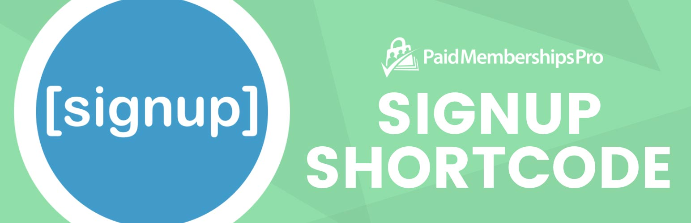

# [Paid Memberships Pro - Signup Shortcode](https://www.paidmembershipspro.com/add-ons/pmpro-signup-shortcode/) #
[comment]: # (Generate badges from shields.io, only works for .org plugins to get other stats etc. We'd have to create our own endpoints for Premium plugins)

### Welcome to the Paid Memberships Pro - Signup Shortcode GitHub Repository

This plugin allows you to embed a shortened membership signup form anywhere in your WordPress site. Use shortcode attributes to set the level ID, which fields to display (you can even sign up members by only asking for an email address!), and more.

For more information please visit [the Add On documentation page for this plugin](https://www.paidmembershipspro.com/add-ons/pmpro-signup-shortcode/).

## Installation ##
For detailed installation steps, visit the [documentation](https://www.paidmembershipspro.com/add-ons/pmpro-signup-shortcode/) page.

1. Download the current development ZIP file directly: `https://github.com/strangerstudios/pmpro-signup-shortcode/archive/dev.zip`

**Please ensure that once installing this version of the plugin to remove `-dev` from the plugin's folder name.**

## Bugs ##
If you find an issue/bug, let us know by [creating a detailed GitHub issue](https://github.com/strangerstudios/pmpro-signup-shortcode/issues/new/choose).

## Support ##
This is a developer's portal for Paid Memberships Pro - Signup Shortcode. We do not offer support on this channel. **Any support related questions should be directed to [our website](https://www.paidmembershipspro.com/add-ons/pmpro-signup-shortcode/).**

## Contributing to Paid Memberships Pro - Signup Shortcode ##
We encourage and welcome any contribution to Paid Memberships Pro - Signup Shortcode. Please read the [guidelines for contributing](https://github.com/strangerstudios/pmpro-signup-shortcode/blob/dev/.github/CONTRIBUTING.md) to this repository.

There are various **ways to the help development** of Paid Memberships Pro - Signup Shortcode:

1. Report [bugs/issues](https://github.com/strangerstudios/pmpro-signup-shortcode/issues/new/choose) on GitHub.
2. Work on any issues by submitting a Pull Request.

Here are some ways for **non-developers to contribute** to Paid Memberships Pro - Signup Shortcode:

1. Translate Paid Memberships Pro - Signup Shortcode into your own [language](https://www.paidmembershipspro.com/paid-memberships-pro-in-your-language/).
2. [Purchase a Plus membership](https://paidmembershipspro.com/pricing) to help fund ongoing development and bug fixes.
